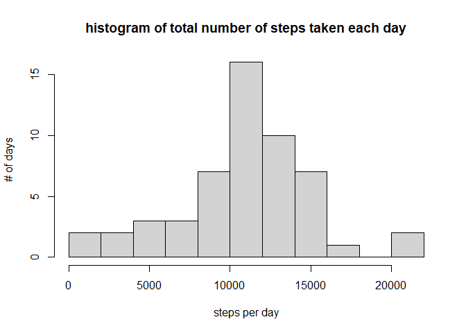
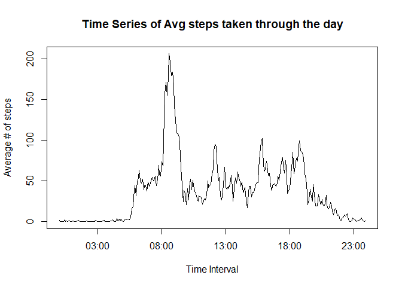

## Loading and preprocessing the data

```r
library(dplyr)
```

```
## 
## Attaching package: 'dplyr'
```

```
## The following objects are masked from 'package:stats':
## 
##     filter, lag
```

```
## The following objects are masked from 'package:base':
## 
##     intersect, setdiff, setequal, union
```

```r
#Download file
download.file('https://d396qusza40orc.cloudfront.net/repdata%2Fdata%2Factivity.zip','fdata.zip')
#unzip file
unzip('fdata.zip',exdir='fdata')
#read activity csv
fdata <- read.csv('fdata/activity.csv')
#preprocessing, removing Steps that are NA
fdata$intTime <- strptime(sprintf("%02d:%02d", 
                                 as.integer(fdata$interval)%/%100, 
                                 as.integer(fdata$interval)%%100),'%H:%M')
fdata <- transform(fdata, DateTimeInt = as.POSIXct(paste(as.Date(date), format(intTime, "%T"))))
fdata <- fdata[,-c(2,4)]
data <- fdata[!is.na(fdata$steps),]
```

## What is mean total number of steps taken per day?

```r
#Calculate the total number of steps taken per day
tday <- tapply(data$steps,format(data$DateTimeInt, "%D"),sum)
#histogram of the total number of steps taken each day
hist(tday,breaks=10,xlab='steps per day',ylab='# of days',main='histogram of total number of steps taken each day')
```

<!-- -->

```r
#Calculate and report the mean and median of the total number of steps taken per day
round(c(summary(tday)[4],summary(tday)[3]),0)
```

```
##   Mean Median 
##  10766  10765
```

## What is the average daily activity pattern?

```r
#Calculate the average number of steps for each interval
aint <- tapply(data$steps,data$interval,mean)
aint <- data.frame(interval=names(aint), steps=aint)
#convert interval to time for the time series plot
aint$DateTimeInt <- strptime(sprintf("%02d:%02d", 
                                     as.integer(aint$interval)%/%100, 
                                     as.integer(aint$interval)%%100),'%H:%M')
#time series plot of the 5-minute interval and the average number of steps taken
plot(aint$DateTimeInt,aint$steps,type='l',xlab='Time Interval', ylab='Average # of steps',main='Time Series of Avg steps taken through the day')
```

<!-- -->

```r
#Which 5-minute interval, on average across all the days in the dataset, contains the maximum number of steps?
format(aint[which.max(aint$steps),3],"%T")
```

```
## [1] "08:35:00"
```

## Imputing missing values

```r
#Calculate and report the total number of missing values in the dataset (i.e. the total number of rows with NA)
sum(is.na(fdata$steps))
```

```
## [1] 2304
```

```r
#Devise a strategy for filling in all of the missing values in the dataset. The strategy does not need to be sophisticated. For example, you could use the mean/median for that day, or the mean for that 5-minute interval, etc.
mrg <- merge(fdata,aint,by = 'interval')
mrg$steps <- coalesce(mrg$steps.x,mrg$steps.y)
#Create a new dataset that is equal to the original dataset but with the missing data filled in.
mrg <- mrg[,-c(2,4,5)]
mrg <- mrg[,c(3,1,2)]
mrg <- mrg[order(mrg$DateTimeInt.x),]
names(mrg) <- c('steps','interval','DateTimeInt')
#Make a histogram of the total number of steps taken each day and Calculate and report the mean and median total number of steps taken per day.
tday2 <- tapply(mrg$steps,format(mrg$DateTimeInt, "%D"),sum)
hist(tday2,breaks=10,xlab='steps per day',ylab='# of days',main='histogram of total number of steps taken each day')
```

<!-- -->

```r
round(c(summary(tday2)[4],summary(tday2)[3]),0)
```

```
##   Mean Median 
##  10766  10766
```

```r
#Do these values differ from the estimates from the first part of the assignment? What is the impact of imputing missing data on the estimates of the total daily number of steps?
```

There is almost no difference in the estimates from the first part of the assignment. The impact is that we now have more data and therefore more frequencies of occurrence in the histogram and of course more daily number of steps.

## Are there differences in activity patterns between weekdays and weekends?

```r
#Create a new factor variable in the dataset with two levels – “weekday” and “weekend” indicating whether a given date is a weekday or weekend day.
mrg$weekend <- factor(weekdays(mrg$DateTimeInt)=='Saturday' | weekdays(mrg$DateTimeInt)=='Sunday')
levels(mrg$weekend) <- factor(c("weekday", "weekend"))
#Make a panel plot containing a time series plot of the 5-minute interval and the average number of steps taken, averaged across all weekday days or weekend days (y-axis). See the README file in the GitHub repository to see an example of what this plot should look like using simulated data.
aint2 <- tapply(mrg$steps,mrg[,c(2,4)],mean)
aint2 <- as.data.frame(as.table(aint2))
names(aint2) <- c('interval',"weekend","steps")
aint2$interval <- as.character(aint2$interval)
aint2$DateTimeInt <- strptime(sprintf("%02d:%02d", 
                                  as.integer(aint2$interval)%/%100, 
                                  as.integer(aint2$interval)%%100),'%H:%M')

par(mfrow = c(1,2))
d0 <- subset(aint2,weekend == 'weekday')
plot(d0$DateTimeInt,d0$steps,type='l',xlab='Time Interval', ylab='Average # of steps',main='Avg steps on Weekdays')
d1 <- subset(aint2,weekend == 'weekend')
plot(d1$DateTimeInt,d1$steps,type='l',xlab='Time Interval', ylab='Average # of steps',main='Avg steps on Weekend days')
```

<!-- -->

